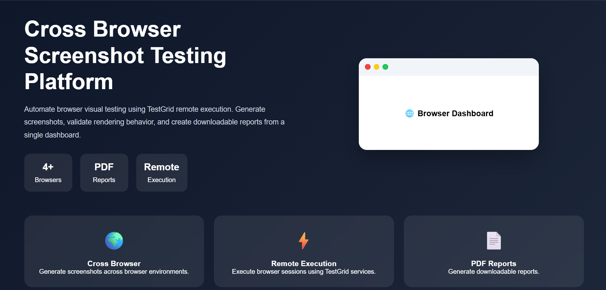
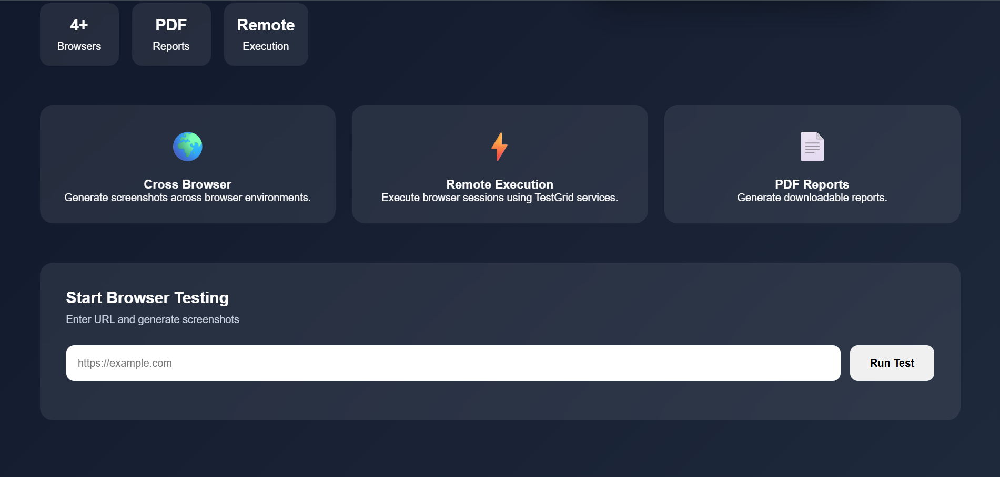
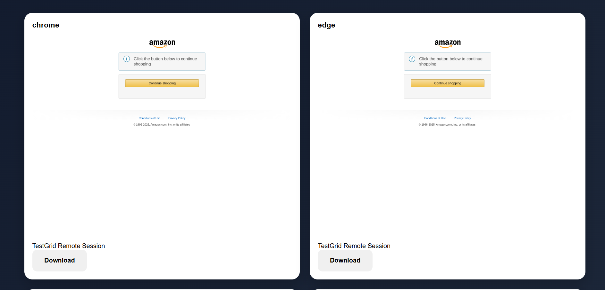
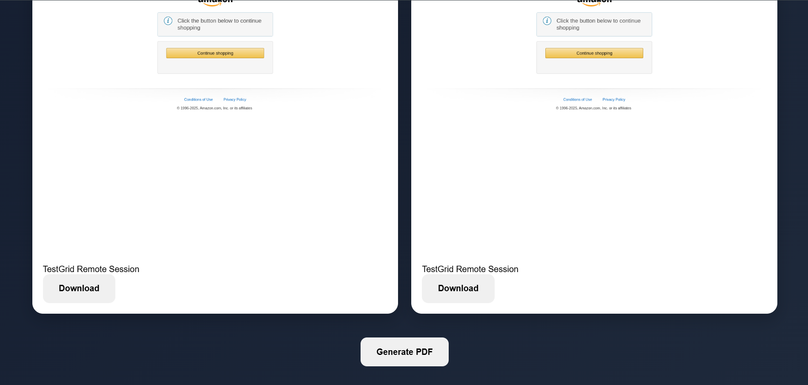

# Cross Browser Screenshot Testing Platform

A lightweight browser automation and visual validation platform built using Node.js, Selenium WebDriver, and remote browser infrastructure.

This application enables users to enter a target URL and automatically generate browser screenshots through remote browser execution. Screenshots are displayed in a browser grid and can be exported as PDF reports.

---

# Overview

The platform provides a centralized interface for cross-browser visual testing without requiring users to manually open or switch browsers.

Users can:

- Enter a website URL
- Trigger automated browser execution
- Capture screenshots
- View browser results
- Download screenshots
- Export PDF reports

Current browser dashboard:

- Chrome
- Edge
- Safari
- Firefox

---
# 📸 Platform Preview

## Home Screen

<p align="center">
   
</p>

---

## Enter URL Interface

<p align="center">
   
</p>

---

## Browser Screenshot Results

<p align="center">
   
</p>

---

## PDF Report Generation

<p align="center">
   
</p>

---

# Technology Stack

## Frontend

- HTML5
- CSS3
- JavaScript

## Backend

- Node.js
- Express.js

## Automation

- Selenium WebDriver

## Reporting

- PDFKit

## Environment Management

- dotenv

---

# Dependencies

Install:

```bash
npm install express selenium-webdriver pdfkit dotenv
```

Package usage:

| Package | Purpose |
|----------|----------|
| express | API server |
| selenium-webdriver | Browser automation |
| pdfkit | PDF generation |
| dotenv | Environment variables |

---

# Project Structure

```text
cross-browser-tool/

├── public/
│
│   ├── index.html
│   ├── style.css
│   └── script.js
│
├── screenshots/
│
├── server.js
├── package.json
├── .env
├── .gitignore
├── README.md
```

---

# Environment Configuration

Create:

`.env`

```env
TG_TOKEN=YOUR_TOKEN

CHROME_TG_URL=http://your-endpoint/wd/hub
CHROME_TG_UDID=101
```

---

# Git Ignore

```gitignore
node_modules/
.env
screenshots/
```

Purpose:

- protect credentials
- avoid committing generated assets
- reduce repository size

---

# Running the Project

Install dependencies:

```bash
npm install
```

Start server:

```bash
node server.js
```

Open:

```text
http://localhost:3000
```

---

# Current Features

### Browser Dashboard

- Chrome
- Edge
- Safari
- Firefox

### Screenshot Features

- Full-page screenshot generation
- Download screenshots
- Browser result grid

### Reporting

- PDF export

### Validation

- URL validation

### Configuration

- Environment-based credentials

---

# Error Handling

Handled scenarios:

URL validation:

```text
Invalid URL
```

Session failures:

```text
New session request timed out
```

Connection issues:

```text
502 Bad Gateway
```

PDF generation:

```text
PDF Error
```

---

# Future Enhancements

### Visual Comparison

Pixel-based screenshot diffing

### Responsive Testing

Mobile and tablet breakpoints

### Scheduling

Automated recurring runs

### Dashboard

Execution history

### CI/CD

GitHub Actions integration

### Shareable Reports

Public links and report storage

---

# Infrastructure

Remote browser execution and device services powered by [TestGrid.io](https://testgrid.io)
